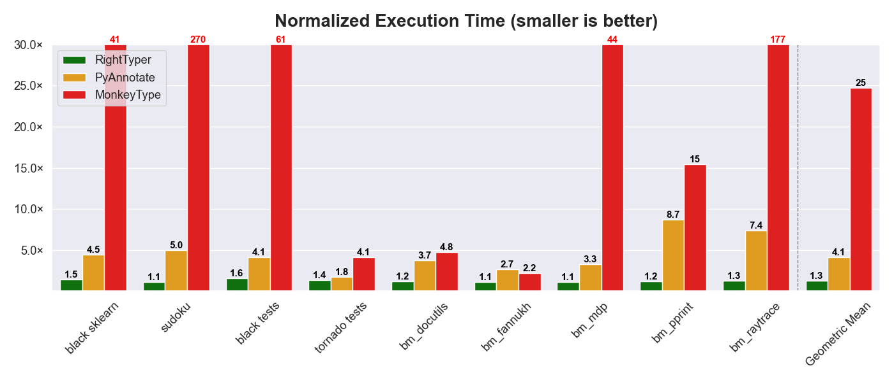

# RightTyper


[](https://pypi.org/project/righttyper/)

[](https://pepy.tech/project/righttyper)


RightTyper is a Python tool that automatically generates type
annotations for your code. It monitors your program as it runs and
records the types of function arguments, return values, local
variables, and class fields.

RightTyper builds on Python 3.12+'s `sys.monitoring` and uses
adaptive sampling — Poisson-timed capture windows for function calls
and Good–Turing estimation for container elements — to achieve high
type recall with only about 25% runtime overhead. This makes it easy
to integrate into your existing tests and development workflow, and
lets a type checker like `mypy` catch type mismatches in your code.

Although RightTyper requires Python 3.12+ to run, it can emit
annotations compatible with older Python versions (down to 3.9) via
the `--python-version` flag.

For more details on RightTyper's design and evaluation, see our
[paper](https://arxiv.org/abs/2507.16051).

## Installation

```bash
python3 -m pip install righttyper
```

## Quick Start

You can run RightTyper with arbitrary Python programs and it will
generate types for every function that gets executed:

```bash
python3 -m righttyper your_script.py [args...]
```

It works great in combination with [pytest](https://docs.pytest.org/):

```bash
python3 -m righttyper -m pytest [pytest-args...]
```

By default, RightTyper annotates your source files in place (saving
backups as `.py.bak`). To preview annotations without modifying files,
use `--no-output-files` — annotations will only be written to
`righttyper.out`.

### Example

Given this unannotated code:

```python
def greet(name, greeting="Hello"):
    return f"{greeting}, {name}!"
```

After running RightTyper, you get:

```python
def greet(name: str, greeting: str = "Hello") -> str:
    return f"{greeting}, {name}!"
```

## Performance Comparison

The graph below presents the overhead of using RightTyper versus two
previous tools, PyAnnotate and MonkeyType, across a range of
benchmarks. On average, RightTyper imposes approx. 25% overhead
compared to running plain Python. On the popular "black" formatter,
RightTyper imposes only 50% overhead, while MonkeyType slows
execution by 41x. In extreme cases, MonkeyType runs over 270x
slower than RightTyper.



## Language Support

### Functions, variables, and fields

RightTyper annotates function arguments, return values, local
variables, and attributes. It also infers field types for
[dataclasses](https://docs.python.org/3/library/dataclasses.html),
[attrs](https://www.attrs.org/) classes, and
[NamedTuples](https://docs.python.org/3/library/typing.html#typing.NamedTuple)
by observing their `__init__` calls. When updating existing
annotations, RightTyper preserves `ClassVar` and `Final` wrappers,
only updating the inner type. Variable annotation can be disabled
with `--no-variables`.

### Generators and async generators

RightTyper properly infers `Generator[Y, S, R]` and
`AsyncGenerator[Y, S]` types, including the send protocol.

### Wrapped functions

Decorators like JIT compilers or `functools.wraps` can prevent the
wrapped function from executing directly. RightTyper detects these
cases and propagates types from the wrapper to the wrapped function.
Controlled with `--propagate-wrapped-types` and
`--infer-wrapped-return-type` (both enabled by default).

### Method overrides

When a method overrides one from a parent class, RightTyper merges
the observed types with the parent's annotations (including from
[typeshed](https://github.com/python/typeshed) stubs) to avoid
violating the Liskov Substitution Principle.

## Features

### Type pattern recognition

When a function is called with different types, rather than naively
forming a union, RightTyper searches for recurring patterns across
call traces. When it detects consistent variability, it introduces
type variables to capture the relationship. For example, given:

```python
def add(a, b):
    return a + b

add(10.0, 20.0)
add("foo", "bar")
```

RightTyper infers:

```python
def add[T1: (float, str)](a: T1, b: T1) -> T1:
    return a + b
```

This is more precise than a simple `float | str` union, enabling
`mypy` to catch invalid mixed-type calls like `add(1.0, "bar")`.

### Tensor shape annotations

With `--infer-shapes`, RightTyper generates
[`jaxtyping`](https://docs.kidger.site/jaxtyping/)-compatible shape
annotations for NumPy, JAX, and PyTorch tensors, usable with
[`beartype`](https://github.com/beartype/beartype) or
[`typeguard`](https://typeguard.readthedocs.io/en/latest/).
RightTyper also identifies patterns across observed shapes, replacing
repeated dimensions with symbolic variables.

### Type simplification and supertype resolution

RightTyper simplifies types for readability — `int | bool | float`
becomes `float` (following Python's numeric tower), and `Generator[X,
None, None]` becomes `Iterator[X]`. When multiple concrete types
share a common superclass, RightTyper can replace them with the
supertype rather than forming a large union. Disable with
`--no-simplify-types`.

### Annotation control

By default, RightTyper adds annotations where none exist and leaves
existing ones untouched. Use `--ignore-annotations` to overwrite all
existing annotations with inferred types, or `--only-update-annotations`
to update existing annotations without adding new ones.

### Import management

When an annotation requires a new import, RightTyper adds it inside
an `if TYPE_CHECKING:` block with string annotations, avoiding
circular import issues and other runtime errors.

### Test-borne type exclusion

When tests drive execution, test-specific types like mocks can leak
into annotations. RightTyper automatically detects test modules and
excludes their types from inferred annotations.

### Annotation coverage

Compute how much of your codebase already has type annotations:

```bash
python3 -m righttyper coverage --type summary /your/project
```

### Accumulating observations across runs

For large projects or CI pipelines, you can accumulate type
observations across multiple runs before emitting annotations:

```bash
python3 -m righttyper run --only-collect -m pytest tests/unit/
python3 -m righttyper run --only-collect -m pytest tests/integration/
python3 -m righttyper process
```

### Output formats

- Annotated source files (default, with `.py.bak` backups)
- `.pyi` stub files (`--generate-stubs`)
- JSON (`--json-output`) for CI/tooling integration
- `--type-distribution-comments` adds comments showing the observed
  frequency of each type next to polymorphic annotations

### Type ergonomics

Inferred types can sometimes be verbose. RightTyper provides options
to make them more readable:

- `--type-depth-limit N` — caps generic nesting depth:
  `list[tuple[tuple[int, int]]]` → `list[tuple]` (with N=1)
- `--generalize-tuples N` — collapses homogeneous fixed-length tuples:
  `tuple[int, int, int]` → `tuple[int, ...]` (with N=3)
- `--max-union-size N` — collapses large unions:
  `int | float | str | bytes | list` → `Any` (with N=4)

### Option overview

Below is the full list of options:

```
Usage: python -m righttyper [OPTIONS] COMMAND [ARGS]...

Options:
  --version  Show the version and exit.
  --help     Show this message and exit.

Commands:
  coverage  Computes annotation coverage.
  process   Processes type information collected with the 'run' command.
  run       Runs a given script or module, collecting type information.

---- Help for 'run': ----
Usage: python -m righttyper run [OPTIONS] [SCRIPT] [ARGS]...

  Runs a given script or module, collecting type information.

Options:
  -m, --module TEXT               Run the given module instead of a script.
  --exclude-files GLOB            Exclude the given files (using fnmatch). Can
                                  be passed multiple times.
  --exclude-test-files / --no-exclude-test-files
                                  Automatically exclude test modules from
                                  typing.  [default: exclude-test-files]
  --include-functions REGEX       Only annotate functions matching the given
                                  regular expression. Can be passed multiple
                                  times.
  --infer-shapes                  Produce tensor shape annotations (compatible
                                  with jaxtyping).
  --root DIRECTORY                Process only files under the given
                                  directory.  If omitted, the script's
                                  directory (or, for -m, the current
                                  directory) is used.
  --poisson-rate FLOAT RANGE      Expected sample captures per second (Poisson
                                  process rate).  [default: 2.0; x>=0.1]
  --sampling / --no-sampling      Whether to sample calls or to use every one.
                                  [default: sampling]
  --no-sampling-for REGEX         Rather than sample, record every invocation
                                  of any functions matching the given regular
                                  expression. Can be passed multiple times.
  --replace-dict / --no-replace-dict
                                  Whether to replace 'dict' to enable
                                  efficient, statistically correct samples.
                                  [default: no-replace-dict]
  --container-small-threshold INTEGER RANGE
                                  Containers at or below this size are fully
                                  scanned instead of sampled.  [default: 32;
                                  x>=1]
  --container-max-samples INTEGER RANGE
                                  Maximum number of entries to sample for a
                                  container.  [default: 128; x>=1]
  --container-type-threshold FLOAT RANGE
                                  Stop sampling a container if the estimated
                                  likelihood of finding a new type falls below
                                  this threshold.  [default: 0.05; x>=0.01]
  --container-sample-range [INTEGER|none]
                                  Largest index from which to sample in a
                                  container when direct access isn't
                                  available; 'none' means unlimited.
                                  [default: 1000]
  --container-min-samples INTEGER RANGE
                                  Minimum samples before checking Good-Turing
                                  stopping criterion.  [default: 24; x>=1]
  --container-check-probability FLOAT RANGE
                                  Probability of spot-checking a container for
                                  new types.  [default: 0.5; 0.0<=x<=1.0]
  --max-union-size INTEGER RANGE  Maximum distinct types in a union before
                                  collapsing to Any.  [default: 32; x>=1]
  --resolve-mocks / --no-resolve-mocks
                                  Whether to attempt to resolve test types,
                                  such as mocks, to non-test types.  [default:
                                  no-resolve-mocks]
  --test-modules MODULE           Additional modules (besides those detected)
                                  whose types are subject to mock resolution
                                  or test type exclusion, if enabled. Matches
                                  submodules as well. Can be passed multiple
                                  times.  [default: pytest, _pytest, py.test,
                                  unittest]
  --adjust-type-names / --no-adjust-type-names
                                  Whether to look for a canonical name for
                                  types, rather than use the module and name
                                  where they are defined.  [default: adjust-
                                  type-names]
  --variables / --no-variables    Whether to (observe and) annotate variables.
                                  [default: variables]
  --only-collect                  Rather than immediately process collect
                                  data, save it to "righttyper-N.rt". You can
                                  later process using RightTyper's "process"
                                  command.
  --generalize-tuples N           Generalize homogenous fixed-length tuples to
                                  tuple[T, ...] if length ≥ N.  N=0 disables
                                  generalization.  [default: 3; x>=0]
  --propagate-wrapped-types / --no-propagate-wrapped-types
                                  Whether to propagate types to wrapped
                                  functions (via __wrapped__) that never
                                  execute directly.  [default: propagate-
                                  wrapped-types]
  --infer-wrapped-return-type / --no-infer-wrapped-return-type
                                  When propagating types to wrapped functions,
                                  whether to infer return type from the
                                  wrapper's return value.  [default: infer-
                                  wrapped-return-type]
  --eval-sampling                 Enable parallel exhaustive scanning to
                                  measure sampling accuracy. Significant
                                  performance overhead.
  --log-sampling                  Enable structured logging of container
                                  sampling decisions to righttyper-
                                  sampling.jsonl.
  --debug                         Include diagnostic information in log file.
  Output options:
    --overwrite / --no-overwrite  Overwrite ".py" files with type information.
                                  If disabled, ".py.typed" files are written
                                  instead. The original files are saved as
                                  ".py.bak".  [default: overwrite]
    --output-files / --no-output-files
                                  Output annotated files (possibly
                                  overwriting, if specified).  If disabled,
                                  the annotations are only written to
                                  righttyper.out.  [default: output-files]
    --ignore-annotations          Ignore existing annotations and overwrite
                                  with type information.
    --only-update-annotations     Overwrite existing annotations but never add
                                  new ones.
    --generate-stubs              Generate stub files (.pyi).
    --json-output                 Output inferences in JSON, instead of
                                  writing righttyper.out.
    --use-multiprocessing / --no-use-multiprocessing
                                  Whether to use multiprocessing.  [default:
                                  use-multiprocessing]
    --type-depth-limit [INTEGER|none]
                                  Maximum depth (types within types) for
                                  generic types; 'none' to disable.  [default:
                                  none]
    --python-version [3.9|3.10|3.11|3.12|3.13]
                                  Python version for which to emit
                                  annotations.  [default: 3.12]
    --use-top-pct PCT             Only use the PCT% most common call traces.
                                  [default: 100; 1<=x<=100]
    --use-typing-never / --no-use-typing-never
                                  Whether to emit "typing.Never" (for Python
                                  versions that support it).  [default: no-
                                  use-typing-never]
    --simplify-types / --no-simplify-types
                                  Whether to attempt to simplify types, such
                                  as int|bool|float -> float. or Generator[X,
                                  None, None] -> Iterator[X]  [default:
                                  simplify-types]
    --exclude-test-types / --no-exclude-test-types
                                  Whether to exclude or replace with
                                  "typing.Any" types defined in test modules.
                                  [default: exclude-test-types]
    --detect-test-modules-by-name / --no-detect-test-modules-by-name
                                  Heuristically detect test modules by naming
                                  convention (test_, _test, .tests.).
                                  [default: no-detect-test-modules-by-name]
    --always-quote-annotations / --no-always-quote-annotations
                                  Place all annotations in quotes. This is
                                  normally not necessary, but can help avoid
                                  undefined symbol errors.  [default: no-
                                  always-quote-annotations]
    --type-distribution-comments / --no-type-distribution-comments
                                  Add comments showing the distribution of
                                  observed types next to annotations with
                                  multiple types.  [default: no-type-
                                  distribution-comments]
  --help                          Show this message and exit.
```
