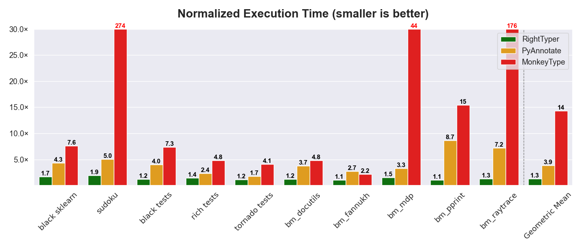

# RightTyper


[](https://pypi.org/project/righttyper/)

[](https://pepy.tech/project/righttyper)


RightTyper is a Python tool that generates types for your function arguments and return values.
RightTyper lets your code run at nearly full speed (below 25% overhead) and little memory overhead.
As a result, you won't experience slowdowns in your code or large memory consumption while using it,
allowing you to integrate it with your standard tests and development process.
By virtue of its design, and in a significant departure from previous approaches, RightTyper only captures the most commonly used types,
letting a type checker like `mypy` detect possibly incorrect type mismatches in your code.

You can run RightTyper with arbitrary Python programs and it will generate types for every function that gets executed.
It works great in combination with [pytest](https://docs.pytest.org/):

```bash
python3 -m righttyper run -m pytest --continue-on-collection-errors /your/test/dir
```

In addition to generating types, RightTyper has the following features:

* It efficiently computes type annotation "coverage" for a file or directory of files
* It infers shape annotations for NumPy/JAX/PyTorch tensors, compatible with [`jaxtyping`](https://docs.kidger.site/jaxtyping/) and [`beartype`](https://github.com/beartype/beartype) or [`typeguard`](https://typeguard.readthedocs.io/en/latest/).

For details about how RightTyper works, please see the following paper: **[RightTyper: Effective and Efficient Type Annotation for Python](https://www.arxiv.org/abs/2507.16051)**.


## Performance Comparison
The graph below presents the overhead of using RightTyper versus two previous tools, PyAnnotate and MonkeyType, across a range of benchmarks.
On average, RightTyper imposes less than 25% overhead compared to running plain Python.
On running the popular "black", RightTyper imposes only 30% overhead, while MonkeyType slows down execution by 35x.
In extreme cases, MonkeyType runs over 270x slower than RightTyper.



## Usage
Install RightTyper from `pip` as usual:

```bash
python3 -m pip install righttyper
```

To use RightTyper, simply run your script with `python3 -m righttyper run` instead of `python3`:

```bash
python3 -m righttyper run your_script.py [args...]
```

This will execute `your_script.py` with RightTyper's monitoring
enabled. The type signatures of all functions will be recorded and
output to a file named `righttyper.out`. The file contains, for every
function, the signature, and a diff of the original function with the
annotated version. It also optionally (with the `--infer-shapes` flag)
generates `jaxtyping`-compatible shape
annotations for NumPy/JAX/PyTorch tensors. Below is an example:

```diff
test-hints.py:
==============

barnacle

- def barnacle(x):
+ def barnacle(x: jaxtyping.Float64[np.ndarray, "10 D1"]) -> jaxtyping.Float64[np.ndarray, "D1"]:

fooq

- def fooq(x: int, y) -> bool:
+ def fooq(x: int, y: int) -> bool:
?                   +++++
```

To add type hints directly to your code, use this command:

```bash
python3 -m righttyper run --output-files --overwrite your_script.py [args...]
```

To do the same with `pytest`:

```bash
python3 -m righttyper run --output-files --overwrite -m pytest [pytest-args...]
```

### Type ergonomics
RightTyper may infer types that include deeply nested generics.
While such precise types improve recall in type checking, they can be difficult for developers to read and understand.
To improve the ergonomics of such annotations, RightTyper offers a `--type-depth-limit` option to specify the maximum
number of levels to include in type.
For example, with `--type-depth-limit=1`, a type inferred as `list[tuple[tuple[int, int]]]` would be emitted as `list[tuple]` instead.

### Option overview
Below is the full list of options for the run command:

```
Usage: python -m righttyper [OPTIONS] COMMAND [ARGS]...

Options:
  --version  Show the version and exit.
  --help     Show this message and exit.

Commands:
  coverage  Computes annotation coverage.
  process   Processes type information collected with the 'run' command.
  run       Runs a given script or module, collecting type information.

---- Help for 'run': ----
Usage: python -m righttyper run [OPTIONS] [SCRIPT] [ARGS]...

  Runs a given script or module, collecting type information.

Options:
  -m, --module TEXT               Run the given module instead of a script.
  --all-files                     Process any files encountered, including
                                  libraries (except for those specified in
                                  --include-files)
  --include-files REGEX           Process only files matching the given
                                  regular expression. Can be passed multiple
                                  times.
  --exclude-test-files / --no-exclude-test-files
                                  Automatically exclude test modules from
                                  typing.  [default: exclude-test-files]
  --include-functions REGEX       Only annotate functions matching the given
                                  regular expression. Can be passed multiple
                                  times.
  --infer-shapes                  Produce tensor shape annotations (compatible
                                  with jaxtyping).
  --root DIRECTORY                Process only files under the given
                                  directory.  If omitted, the script's
                                  directory (or, for -m, the current
                                  directory) is used.
  --target-overhead FLOAT         Target overhead, as a percentage (e.g., 5).
                                  [default: 5.0]
  --sampling / --no-sampling      Whether to sample calls or to use every one.
                                  [default: sampling]
  --no-sampling-for REGEX         Rather than sample, record every invocation
                                  of any functions matching the given regular
                                  expression. Can be passed multiple times.
  --replace-dict / --no-replace-dict
                                  Whether to replace 'dict' to enable
                                  efficient, statistically correct samples.
                                  [default: no-replace-dict]
  --container-sample-limit [INTEGER|none]
                                  Maximum number of container elements
                                  considered when sampling; 'none' means
                                  unlimited.  [default: 1000]
  --resolve-mocks / --no-resolve-mocks
                                  Whether to attempt to resolve test types,
                                  such as mocks, to non-test types.  [default:
                                  no-resolve-mocks]
  --test-modules MODULE           Additional modules (besides those detected)
                                  whose types are subject to mock resolution
                                  or test type exclusion, if enabled. Matches
                                  submodules as well. Can be passed multiple
                                  times.  [default: pytest, _pytest, py.test,
                                  unittest]
  --adjust-type-names / --no-adjust-type-names
                                  Whether to look for a canonical name for
                                  types, rather than use the module and name
                                  where they are defined.  [default: adjust-
                                  type-names]
  --variables / --no-variables    Whether to (observe and) annotate variables.
                                  [default: variables]
  --only-collect                  Rather than immediately process collect
                                  data, save it to "righttyper-N.rt". You can
                                  later process using RightTyper's "process"
                                  command.
  --debug                         Include diagnostic information in log file.
  Output options: 
    --overwrite / --no-overwrite  Overwrite ".py" files with type information.
                                  If disabled, ".py.typed" files are written
                                  instead. The original files are saved as
                                  ".py.bak".  [default: overwrite]
    --output-files / --no-output-files
                                  Output annotated files (possibly
                                  overwriting, if specified).  If disabled,
                                  the annotations are only written to
                                  righttyper.out.  [default: output-files]
    --ignore-annotations          Ignore existing annotations and overwrite
                                  with type information.
    --only-update-annotations     Overwrite existing annotations but never add
                                  new ones.
    --generate-stubs              Generate stub files (.pyi).
    --json-output                 Output inferences in JSON, instead of
                                  writing righttyper.out.
    --use-multiprocessing / --no-use-multiprocessing
                                  Whether to use multiprocessing.  [default:
                                  use-multiprocessing]
    --type-depth-limit [INTEGER|none]
                                  Maximum depth (types within types) for
                                  generic types; 'none' to disable.  [default:
                                  none]
    --python-version [3.9|3.10|3.11|3.12|3.13]
                                  Python version for which to emit
                                  annotations.  [default: 3.12]
    --use-top-pct PCT             Only use the PCT% most common call traces.
                                  [default: 80; 1<=x<=100]
    --use-typing-never / --no-use-typing-never
                                  Whether to emit "typing.Never".  [default:
                                  use-typing-never]
    --simplify-types / --no-simplify-types
                                  Whether to attempt to simplify types, such
                                  as int|bool|float -> float. or Generator[X,
                                  None, None] -> Iterator[X]  [default:
                                  simplify-types]
    --exclude-test-types / --no-exclude-test-types
                                  Whether to exclude or replace with
                                  "typing.Any" types defined in test modules.
                                  [default: exclude-test-types]
  --help                          Show this message and exit.
```
